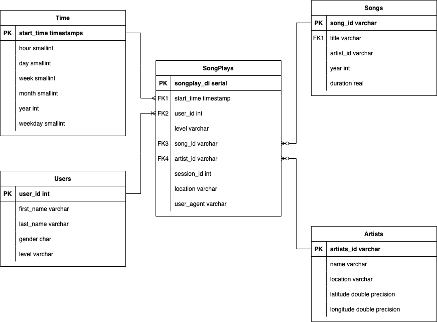

# Discuss the purpose of this database

This database contains the information of the songs and users activities collected on the application. The purpose of this database is to create an approach to the database that can help analytics team retrive data easily and quickly.

# How to run Python scripts

### Run the scripts by terminal :
1. python create_tables.py
2. python etl.py

# Database schema design

The database schema is organized in a star schema. The schema haves 1 fact table and 4 dimention tables. You can see the schema below for more detail.

# ETL Pipeline

### Directory: data/song_data
This directory stored JSON files. Each file contains data about a song such as artist name, artist id, song id, title, year and duration of that song.

### Directory: data/log_data
This directory record data about users activities on app including the songs they listened to, the time they started listening to, the browser they used, etc. 

### create_table.py
This is a python file to create and drop tables. besides, it can create the database.

### sql_queries.py
This is a Python file. The function of this file is to specify the structure of the database and the commands to quey, insert, update data.

### etl.ipynb
This is a Jupyter Notebook file that help you easy to explore the data and make a small example.

### etl.py
This is a Python file. the function of this file is extract data form JSON files, then transfer data to match the schema. After that load them into the database

